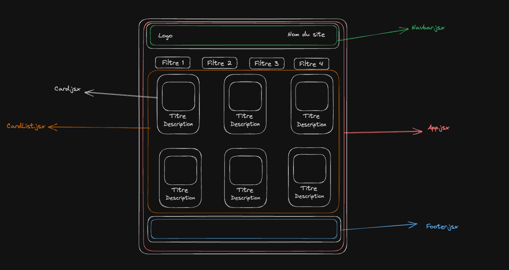

# React Challenge* Props / States
Get ready !



>[wireframe](./images/wireframe.png)

*Les challenges sont des exercices qui vous permettent de mettre en pratique les connaissances acquises. Ils sont à réaliser après avoir terminé les cours et les quêtes.*

## Description
L'idée est de créer une application qui permet de gérer l'affichage des différents articles vendus par votre toute nouvelle société.

Techniquement parlant, il s'agit de vous faire pratiquer les `props` et les `states` de React.

>Alors laissez libre cours à votre imagination et à votre créativité ! 


## Instructions

### 1. Créer un nouveau projet React
Créez un nouveau projet React avec `ViteJS` et nommez le `react-challenge`.

### 2. Composants

Créez les composants suivants :

- `App` : le composant principal
- `Card` : le composant qui affiche un article
- `CardList` : le composant qui affiche la liste des articles
- `Navbar` : le composant qui affiche la barre de navigation,   doit contenir un logo et un titre
- `Footer` : le composant qui affiche le footer

### 3. Données

Créez un fichier `data.json` dans un dossier `data` qui contient un tableau d'objets qui représente les articles à afficher. Chaque objet doit contenir les propriétés suivantes :

- `id` : un identifiant unique
- `title` : le titre de l'article
- `description` : la description de l'article
- `price` : le prix de l'article
- `image` : l'url de l'image de l'article
- `category` : la catégorie de l'article

Vous pourrez ensuite l'importer en utilisant la syntaxe suivante : 
    
    
```js 
import data from './data/data.json
```

  
### 4. Affichage

- Affichez le composant `Navbar` et `Footer` dans le composant `App`
- Affichez le composant `CardList` dans le composant `App`
- Affichez les composants `Card` dans le composant `CardList` en utilisant les données du fichier `data.json`

>Astuce : Vous devrez probablement utiliser la méthode [map](https://react.dev/learn/rendering-lists) pour afficher les articles


### 5. Github

- Créez un nouveau repository sur Github
- Configurez votre projet local pour qu'il pointe vers votre repository
- Ajoutez vos collaborateurs au projet
- Ajoutez le code de votre projet sur Github
- Envoyez le lien de votre repository à votre formateur pour qu'il puisse vérifier votre travail et vous donner son feedback

### 6. Bonus

- Ajouter des filtres dans votre component `App` pour filtrer les articles par catégorie
- Ajouter un bouton `Ajouter au panier` dans le composant `Card` qui permet d'ajouter un article dans un panier
- Afficher le nombre d'articles dans le panier dans le composant `Navbar`
- Afficher le prix total des articles dans le panier dans le composant `Navbar`

## Ressources

- [React](https://reactjs.org/)
- [ViteJS](https://vitejs.dev/)
- [Github](https://github.com)
- [React Props](https://react.dev/learn/passing-props-to-a-component)
- [React States](https://react.dev/learn/state-a-components-memory)
- 

Et bien sûr, votre [Formateur](https://github.com/ioayoub) préféré.

## Auteur

[Ayoub IDRISSI OUEDRHIRI](https://github.com/ioayoub)

## License

[MIT](https://choosealicense.com/licenses/mit/)

## Version

1.0.0 : 2023-10-11